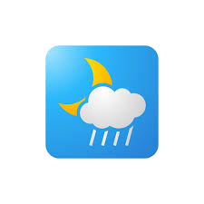

# 🌦️ **WeatherApp**

A simple weather application built using **Kivy** and **KivyMD** that fetches weather data from the **OpenWeather API**.
Designed for Android using **Buildozer**.

---

## 📱 **Features**

- Fetch real-time weather data using city names.
- Display temperature, pressure, humidity, and weather conditions.
- Clean and responsive UI with **Material Design**.
- Lightweight and fast.
- Works offline with an error-handling mechanism.

---

## 🚀 **Screenshots**

| Loading Screen                 | Weather Display            |
|--------------------------------|----------------------------|
|  |  |

---

## 🛠️ **Technologies Used**

- **Python** for the application logic
- **Kivy** for the UI framework
- **KivyMD** for Material Design components
- **OpenWeather API** for weather data
- **Buildozer** for building Android APKs
- **Plyer** for Android permissions

---

## 🧑‍💻 **Prerequisites**

Make sure you have the following installed:

- Python 3.10 or higher
- **Kivy** and **KivyMD**
- **Buildozer** for Android builds
- **Plyer** for requesting permissions
- A valid API key from [OpenWeather API](https://openweathermap.org/api)

---

## 🛎️ **Setup Instructions**

1. **Clone the Repository**
    ```bash
    git clone https://github.com/yourusername/weatherapp.git
    cd weatherapp
    ```

2. **Set Up a Virtual Environment** (optional but recommended)
    ```bash
    python -m venv .venv
    source .venv/bin/activate
    ```

3. **Install Dependencies using Poetry**
    ```bash
    pip install poetry
    poetry install
    ```

4. **Configure API Key**
    - Create a `.env` file in the root directory:
      ```bash
      touch .env
      ```
    - Add your OpenWeather API key:
      ```env
      OPENWEATHER_API_KEY=your_api_key_here
      ```

5. **Run the Application (Desktop Mode)**
    ```bash
    python main.py
    ```

---

## 📦 **Build for Android**

1. **Install Buildozer**
    ```bash
    pip install buildozer
    ```

2. **Initialize Buildozer**
    ```bash
    buildozer init
    ```

3. **Build the APK**
    ```bash
    buildozer -v android debug
    ```

4. **Install and Run on Android**
    ```bash
    buildozer android deploy run
    ```

---

## ⚠️ **Permissions on Android**

The app requires internet access to fetch weather data. On Android, this is handled using `plyer`.

- Ensure the app requests for `INTERNET` permission:
    ```python
    from plyer import permissions
    permissions.request_permission("android.permission.INTERNET")
    ```

- Confirm the following permission is in the `buildozer.spec`:
    ```ini
    android.permissions = INTERNET
    ```

---

## 🧑‍🔧 **Troubleshooting**

- **Buildozer Issues**:  
  If you encounter errors with Buildozer, try the following:
  ```bash
  buildozer clean
  buildozer -v android debug
  ```

- **API Errors**:  
  Ensure your API key is correct and has access to the weather API.

- **Permission Errors**:  
  Ensure `adb` is installed and your Android device has USB debugging enabled.

---

## 📜 **License**

This project is licensed under the MIT License. See the [LICENSE](LICENSE) file for details.

---

## 🌟 **Contributing**

Contributions are welcome! Feel free to fork the repository and submit a pull request.

---

## 🙌 **Acknowledgments**

- [Kivy](https://kivy.org/) for the Python UI framework.
- [KivyMD](https://kivymd.readthedocs.io/) for Material Design components.
- [OpenWeather](https://openweathermap.org/api) for providing weather data.

---

## 📧 **Contact**

For any inquiries, feel free to reach out at [your.email@example.com](mailto:your.email@example.com).